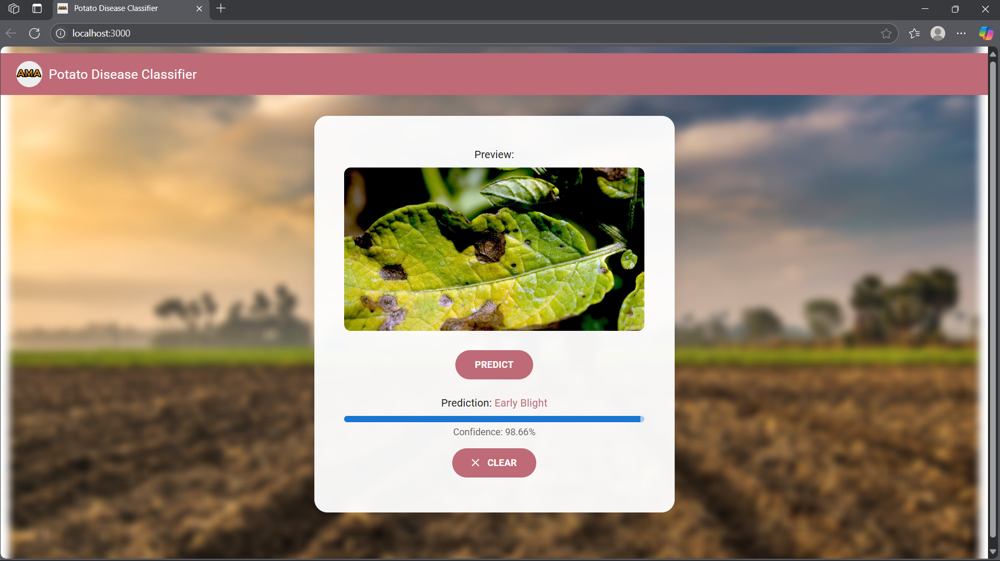

# 🥔🧠 Potato Disease Classification using CNN, FastAPI & React

This project presents a full-stack machine learning system for automated classification of potato leaf diseases using deep learning. It is a complete pipeline involving model training, REST API development, and web-based image classification, built entirely from scratch.

⚡  This project was developed during my early exploration of deep learning and full-stack ML deployment.

---
## 🧪 Problem Statement

Potato crops are highly susceptible to diseases like Early Blight and Late Blight, which can significantly reduce yield and impact food security. Manual inspection is error-prone and time-consuming. The goal of this project was to automate disease diagnosis from leaf images using image classification models, and deliver predictions through an accessible web interface.

---
## 🖼 Preview


---
## 💡 Project Overview
This project uses a Convolutional Neural Network (CNN) trained on the PlantVillage dataset to classify images of potato leaves into:

- 🥔 Early Blight

- 🥔 Late Blight

- 🌱 Healthy

It combines machine learning, API development, and modern UI design to create a smooth end-to-end experience—from uploading an image to getting an accurate diagnosis with a confidence meter.


---
## 🎯 Project Objectives
- Train a Convolutional Neural Network (CNN) to identify diseases from potato leaf images.

- Develop a FastAPI backend to serve the trained model via a REST endpoint.

- Design a React JS frontend with MUI v5 for real-time user interaction.

- Integrate image preview, drag-and-drop upload, and confidence visualization.

- Ensure full local deployment and reproducibility.

  
---
## 🏗️ Architecture
```
User (Image Upload)
      |
      v
React Frontend  <-------> FastAPI Backend  <-------> Trained TensorFlow Model (.h5)
      |                                         |
      |<---- JSON Response (class, confidence)--|
      v
Visualization + Confidence Meter + Preview
```

🛠️ Frontend: React 19 with functional components, MUI 5, Dropzone, Axios

🛠️ Backend: Python 3.10, FastAPI, PIL, NumPy, Uvicorn

🛠️ Model: TensorFlow + Keras CNN trained on preprocessed PlantVillage dataset🧠 Tech Stack

🛠️ Dev Tools:	Jupyter, VS Code, Git, Postman


---
## 📂 Key Components

1. Model Training (Jupyter Notebook)
- - Dataset: PlantVillage (potato leaf subset)

- - Model: 4-layer CNN

- - Preprocessing: Image resizing, normalization, data augmentation

- - Output: potatoes_model.h5 (exported to be served via API)


2. Backend (FastAPI)
- - Handles file uploads

- - Reads and converts images to NumPy arrays using PIL

- - Sends image data to the loaded model and returns:

- - Predicted class (Early Blight, Late Blight, Healthy)

- - Confidence score

- - CORS configured for local frontend access

  Runs on ```localhost:8000```

```
@app.post("/predict")
async def predict(file: UploadFile = File(...)):
    image = read_file_as_image(await file.read())
    img_batch = np.expand_dims(image, 0)
    predictions = model.predict(img_batch)
    ...
```

3. Frontend (React JS)
- - Built with React 19, using modern functional hooks (```useState```, ```useEffect```)

- - File uploads via ```react-dropzone```

- - Image preview before inference

- - Axios call to FastAPI server

- - Customized UI with Material UI 5

- - Confidence displayed as a dynamic visual progress bar

- - Background imagery for visual appeal

---
## ⚙️ Setup & Installation
Backend
```
cd backend
python -m venv venv
source venv/bin/activate   # Windows: venv\Scripts\activate
pip install -r requirements.txt
uvicorn main:app --reload
```

Ensure your main.py loads the .h5 model correctly and listens on port 8000.

Frontend
```
cd frontend
npm install
npm start
```

Ensure you define the backend API endpoint in your .env file:

```
REACT_APP_API_URL=http://localhost:8000/predict
```
---
## 🧠 Model Details
- Architecture:

- - Input: 256x256 RGB image

- - Conv2D (32 filters) → MaxPooling

- - Conv2D (64 filters) → MaxPooling

- - Flatten → Dense(64) → Dense(3, softmax)

- Optimizer: Adam

- Loss Function: Categorical Crossentropy

- Accuracy: ~98% on validation data


---
## 🖼 UI Features
- Drag & Drop image interface

- Live image preview before prediction

- Styled layout using MUI v5 components

- Visual confidence meter (animated)

- Reset button to clear session


---

## 🔬 Future Improvements
- Integrate TensorFlow Serving for scalable deployment

- Add Docker support for containerization

- Improve model robustness with larger dataset and regularization

- Deploy app on cloud (e.g. Vercel + FastAPI on Render)

---
🤝 Credits
Built with ❤️ by **Ama Baduwa Baidoo**
Inspired by  Codebasics YouTube tutorial
Dataset: PlantVillage on Kaggle
Made for learning, showcasing, and growing 🍀

---
---
## 📜 License
MIT License – free for personal, academic, and commercial use.

---
## 🌟 Give It a Star!
If this project inspires, teaches, or helps you — don’t forget to ⭐️ the repo!

---


